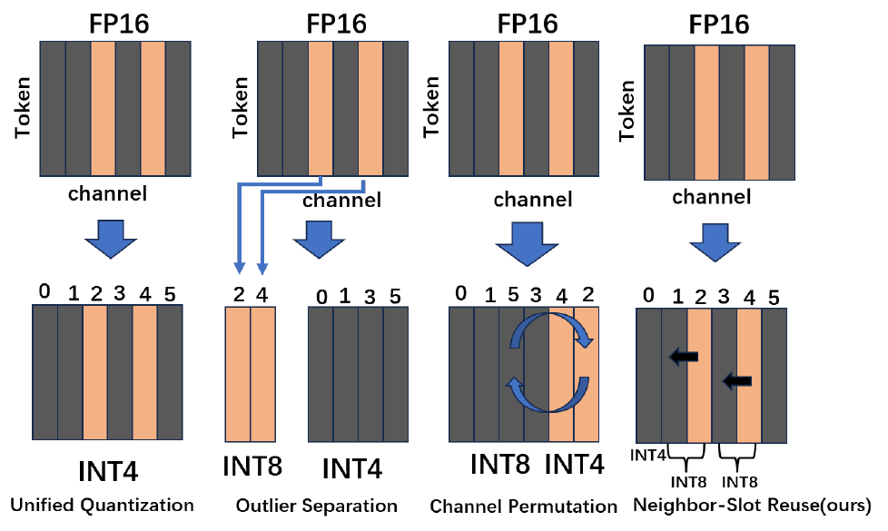
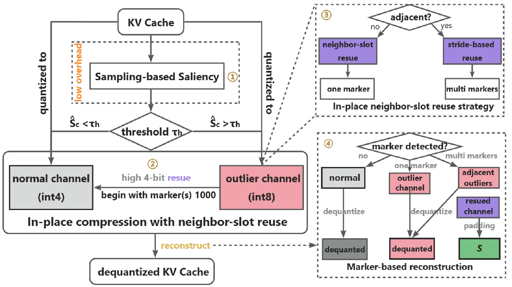

<div align="center">

<h1 style="font-size: 6rem; line-height: 1.1;">InQuant</h1>
<p style="font-size: 6rem;">In-Place Mixed-Precision KV Cache Quantization via Saliency-Aware Neighbor-Slot Reuse</p>

[About](#about) · [Results](#results) · [Installation](#installation) · [Quick Start](#quick-start) · [vLLM](#vllm-extension)

</div>

## About

InQuant compresses the key-value (KV) cache used during language model inference. It gives important channels more precision by borrowing storage from less important channels, keeping the packed layout regular as the context grows. Model weights remain in BF16, and no retraining is required.

The paper **InQuant: In-Place Mixed-Precision KV Cache Quantization via Saliency-Aware Neighbor-Slot Reuse** introduces this approach. This repository includes packed KV codecs, Triton attention kernels, Hugging Face integrations for Qwen2.5 and Mistral, and an experimental vLLM extension.

### The idea

<p align="center">
  
</p>

*Figure 1 compares different ways to store a quantized KV cache.*

Uniform quantization gives every channel the same precision. InQuant stores an important channel's 8-bit value across two existing 4-bit slots: its own slot and one borrowed from a low-saliency channel. The borrowed channel is reconstructed from sampled statistics. This preserves important values without a separate outlier buffer or channel reordering.

### How it works

<p align="center">
  
</p>

*Figure 3 summarizes the compression and reconstruction workflow described in the paper.*

1. **Estimate saliency.** Sample token positions and use channel magnitudes to identify important channels.
2. **Reuse nearby slots.** Split each salient channel's 8-bit code across two 4-bit slots, borrowing one from a less important channel.
3. **Handle adjacent outliers.** Use stride-based searches around contiguous outlier groups and record the selected slots.
4. **Reconstruct during attention.** Follow the layout descriptors to recover salient values and reconstruct borrowed channels from sampled padding statistics.

The implementation includes GPU donor selection, incremental decoding metadata, and Triton attention over packed KV. An attention sink and a recent-token tail remain in full precision. The supplied **K4/V2** presets use 4-bit key slots with 8-bit salient keys and groupwise 2-bit values.

## Repository Layout

```text
InQuant/
├── src/inquant/
│   ├── codec.py                 # Mixed-precision packing and reconstruction
│   ├── value_codec.py           # Groupwise value quantization
│   ├── cache.py                 # Packed history, attention sink, and recent tail
│   ├── qwen_fused.py            # Qwen2 and Mistral attention adapters
│   ├── triton_selection.py      # GPU donor selection
│   ├── triton_attention.py      # Attention over packed KV
│   ├── evaluation.py            # Answer grading and measurement utilities
│   ├── benchmarks.py            # RULER and AIME scoring and protocol checks
│   └── zipcache.py              # Qwen adapter for the upstream ZipCache codec
├── extensions/vllm/             # Optional vLLM plugin and its tests
├── scripts/                     # Model setup, evaluation, profiling, and packaging
├── configs/                     # Model and backend presets
├── benchmarks/                  # Recorded measurements and artifact hashes
├── tests/                       # Codec, cache, and model integration tests
├── docs/assets/                 # Paper figures
├── third_party/                 # Vendored code and license notices
├── requirements-reproduce.txt   # Pinned Hugging Face dependencies
├── pyproject.toml               # Package metadata and installation extras
├── ROADMAP.md                   # Planned development
├── THIRD_PARTY_NOTICES.md        # Third-party attribution
└── LICENSE                      # MIT license
```

The examples create `data/` and `outputs/` locally. Model weights, datasets, and Python environments are not bundled with the source.

## Results

The following measurements use **Qwen2.5-7B-Instruct, BF16 weights, and one NVIDIA A100 40GB**, with one active request. Each request has **32768 input tokens and 128 generated tokens**. The retrieval workload places a passkey at three context depths and repeats each input three times.

| Backend | End-to-end time per request | Passkey retrieval |
|---|---:|---:|
| InQuant · Hugging Face + Triton | 8.225 s | 9/9 |
| InQuant · vLLM 0.9.1 | 6.124 s | 9/9 |

Hugging Face reports the mean of nine request times. The vLLM value is the median time for a group of three sequential requests divided by three. Model loading and warmup are excluded. These results measure long-context retrieval and runtime, rather than GSM8K or MATH500 test accuracy.

The Hugging Face run uses **394.05 MiB** for persistent KV and decode state, including packed values, scales, metadata, the full-precision sink and tail, and decode workspace. vLLM reports active cache storage separately from its reserved memory pool.

See the [measurement record](benchmarks/runtime_20260925.json) for sample counts, timing details, and source and artifact hashes.

<!-- BEGIN RULER AIME RESULTS -->
### RULER v1 and AIME 2026

This **RULER v1 pilot** covers all 13 classic tasks with **5 samples per task at each context length**. AIME 2026 uses all **30 questions** with greedy decoding and an **8192-token output cap**. All methods use Qwen2.5-7B-Instruct with BF16 weights on an A100 40GB, with the Hugging Face backend (Transformers 4.53.3) and batch size 1.

| Method | RULER 8K | RULER 16K | RULER 32K | AIME 2026 accuracy |
|---|---:|---:|---:|---:|
| BF16 | 90.90 | 92.56 | 89.72 | 10.00% (3/30) |
| InQuant K4/V2 | 90.90 | 92.10 | 88.03 | 6.67% (2/30) |
| SnapKV | 82.13 | 77.33 | 78.85 | 6.67% (2/30) |
| Knorm | 32.97 | 35.44 | 31.59 | 0.00% (0/30) |
| ZipCache | 70.26 | 61.87 | 37.90 | 0.00% (0/30) |

InQuant has the highest RULER score among the compressed methods at all three tested lengths.

At 32K, InQuant scores **88.03**, compared with **89.72** for BF16, while reducing measured persistent KV and decode state by **78.21%** on average across paired requests. On AIME, InQuant answers **2/30** correctly, compared with **3/30** for BF16. The long-context result should therefore be read separately from competition-math accuracy.


RULER reports the mean of the 13 official task scores on a 0–100 scale; tasks with multiple targets receive fractional credit. AIME reports exact final-answer accuracy. One AIME question changes accuracy by 3.33 percentage points. The RULER sample size should be kept in mind when comparing small score differences.

| Method | RULER 32K persistent KV and decode state | Mean paired reduction vs BF16 | AIME length-limit stops |
|---|---:|---:|---:|
| BF16 | 1784.78 MiB | 0.00% | 1/30 |
| InQuant K4/V2 | 386.77 MiB | 78.21% | 3/30 |
| SnapKV | 892.72 MiB | 49.94% | 4/30 |
| Knorm | 892.72 MiB | 49.91% | 3/30 |
| ZipCache | 405.63 MiB | 77.20% | 1/30 |

Storage is the median of per-request persistent-cache measurements, including each method’s metadata and retained full-precision state. The reduction column averages each request’s reduction against its matching BF16 request. SnapKV and Knorm remove 50% of prefill tokens; ZipCache uses its 4/2-bit preset with a 40% unimportant-token fraction. These presets do not have identical cache budgets. No compression setting was tuned on these benchmark questions.

See the [complete per-task report](benchmarks/ruler_aime2026.json) for task scores, output lengths, descriptive latency, and provenance. The [evaluation example](#ruler-and-aime-2026) reproduces the protocol. EOS stopping gives different output lengths across methods, so these runs are not used to claim a fixed-work speedup.
<!-- END RULER AIME RESULTS -->

## Installation

The tested environment is **Linux, Python 3.12, PyTorch 2.7.0, CUDA 12.6, Triton 3.3.0, and Transformers 4.53.3**. Run the commands below from the repository root with a compatible NVIDIA driver installed.

```bash
python3.12 -m venv .venv
.venv/bin/python -m pip install --upgrade pip
.venv/bin/python -m pip install torch==2.7.0 --index-url https://download.pytorch.org/whl/cu126
.venv/bin/python -m pip install -c requirements-reproduce.txt -e '.[hf,press,test]'
```

The `press` extra provides the SnapKV and Knorm baselines. The ZipCache codec is included in `third_party/`. The vLLM extension uses a [separate environment](#vllm-extension).


### Model files

The examples use local Hugging Face checkpoints in these directories:

```text
models/
├── Qwen2.5-7B-Instruct/
└── Mistral-7B-Instruct-v0.2/
```

Use `--model` to select a checkpoint stored elsewhere. Each directory should contain its model configuration, tokenizer, and weights. The Mistral presets load local files only.

<details>
<summary>Download the Qwen2.5 checkpoint used in the measurements</summary>

```bash
.venv/bin/python scripts/download_model.py \
  --repo Qwen/Qwen2.5-7B-Instruct \
  --revision a09a35458c702b33eeacc393d103063234e8bc28 \
  --destination models/Qwen2.5-7B-Instruct \
  --manifest models/Qwen2.5-7B-Instruct/download_manifest.json
```

The downloader resumes partial downloads and verifies weight-file SHA256 hashes.

</details>

## Quick Start

### Prepare the data

Download and export GSM8K once for both model examples:

```bash
.venv/bin/python scripts/prepare_data.py --dataset gsm8k \
  --revision 740312add88f781978c0658806c59bc2815b9866 \
  --recorded-test-format --output data/gsm8k.jsonl
```

The commands below run four examples with greedy decoding and up to 2048 generated tokens. Remove `--limit 4` to evaluate the full test split. The runner checks for at least 24 GiB of free GPU memory by default.

### Qwen2.5-7B-Instruct

```bash
CUDA_VISIBLE_DEVICES=0 .venv/bin/python scripts/run_eval.py \
  --model models/Qwen2.5-7B-Instruct \
  --method inquant_fused --config configs/qwen2.5_7b_latest_k4v2.json \
  --data data/gsm8k.jsonl --limit 4 \
  --output outputs/qwen/gsm8k_smoke.jsonl

.venv/bin/python scripts/summarize_results.py \
  outputs/qwen/gsm8k_smoke.jsonl --output outputs/qwen/summary.json
```

### Mistral-7B-Instruct

```bash
CUDA_VISIBLE_DEVICES=0 .venv/bin/python scripts/run_eval.py \
  --model models/Mistral-7B-Instruct-v0.2 \
  --method inquant_fused --config configs/mistral_7b_k4v2.json \
  --data data/gsm8k.jsonl --limit 4 \
  --output outputs/mistral/gsm8k_smoke.jsonl

.venv/bin/python scripts/summarize_results.py \
  outputs/mistral/gsm8k_smoke.jsonl --output outputs/mistral/summary.json
```

Each JSONL record includes the generated answer, correctness, token counts, elapsed time, and persistent cache bytes. The summary collects accuracy, latency, and storage measurements. Four examples provide a quick inference check; use the full test split for accuracy reporting.

For a BF16 control, use the same model, data, and configuration with `--method bf16` and a separate output file. Add `--dry-run` to check an evaluation command without loading the model. Existing output files are protected against overwriting; use a new filename or `--resume` to continue a matching evaluation.

## Evaluation Examples

### MATH500

```bash
.venv/bin/python scripts/prepare_data.py --dataset math500 \
  --revision 6e4ed1a2a79af7d8630a6b768ec859cb5af4d3be \
  --recorded-test-format --output data/math500.jsonl

CUDA_VISIBLE_DEVICES=0 .venv/bin/python scripts/run_eval.py \
  --model models/Qwen2.5-7B-Instruct \
  --method inquant_fused --config configs/qwen2.5_7b_latest_k4v2.json \
  --data data/math500.jsonl --output outputs/qwen/math500.jsonl

CUDA_VISIBLE_DEVICES=0 .venv/bin/python scripts/run_eval.py \
  --model models/Mistral-7B-Instruct-v0.2 \
  --method inquant_fused --config configs/mistral_7b_k4v2.json \
  --data data/math500.jsonl --output outputs/mistral/math500.jsonl
```

MATH500 answers are graded with `math-verify`. Data preparation requires network access and refuses to overwrite an existing dataset file.

### RULER and AIME 2026

Use **RULER v1** to test retrieval, variable tracking, word frequency, and question answering across long contexts. The examples below cover all 13 classic tasks at 8K, 16K, and 32K, with **5 samples per task and length**. This is a 195-example pilot, not a full RULER leaderboard run. Increase `--samples-per-task` to 500 and choose a new output filename for a larger evaluation.

**AIME 2026** adds all 30 competition math problems with greedy decoding and an 8192-token output cap. Accuracy is exact final-integer accuracy, with leading zeros accepted. The dataset publisher calls its Hub split `train`; here those questions are held out for evaluation and are not used to tune compression settings.

Install the data preparation dependencies and check out the pinned RULER generator:

```bash
.venv/bin/python -m pip install -c requirements-reproduce.txt -e '.[benchmarks]'
git clone https://github.com/NVIDIA/RULER.git data/upstream/RULER
git -C data/upstream/RULER checkout c3f5e3b4f87f97e048793bb510a3a6b19a46bf3a

.venv/bin/python scripts/prepare_benchmarks.py fetch-ruler \
  --ruler-repo data/upstream/RULER

.venv/bin/python scripts/prepare_benchmarks.py ruler \
  --ruler-repo data/upstream/RULER --model models/Qwen2.5-7B-Instruct \
  --lengths 8192 16384 32768 --samples-per-task 5 \
  --output data/ruler_pilot.jsonl

.venv/bin/python scripts/prepare_benchmarks.py aime2026 \
  --model models/Qwen2.5-7B-Instruct --output data/aime2026.jsonl
```

Preparation records the generator revision, tokenizer identity, corpus hashes, prompts, and output budgets. Each RULER context budget includes both input and output tokens. Prompts use the model's native chat template and RULER's official answer prefix; no prompt is truncated. The 32K preset stays inside Qwen's native context window without YaRN. Downloaded corpora and AIME questions keep their upstream licenses and are excluded from the source archive.

Run all five methods—**BF16, InQuant, SnapKV, Knorm, and ZipCache**—on two GPUs:

```bash
.venv/bin/python scripts/run_benchmark_campaign.py \
  --model models/Qwen2.5-7B-Instruct \
  --ruler-data data/ruler_pilot.jsonl --aime-data data/aime2026.jsonl \
  --gpus 0 1 --output-dir outputs/benchmarks
```

For a single GPU, use `--gpus 0`. The campaign runs RULER first, then AIME, with one process per GPU. It writes per-method predictions to `results/`, logs to `logs/`, and progress to `status.json` inside the output directory. Re-run the same command to resume matching records. A dataset or configuration change requires a new output directory.

InQuant uses the K4/V2 preset. SnapKV and Knorm remove 50% of prefill tokens; ZipCache uses 4/2-bit quantization with a 40% unimportant-token fraction. All methods receive identical prompts and generation budgets. These are comparisons at the stated presets, not comparisons at equal cache size. The report includes measured persistent KV bytes.

After the campaign completes, `summary.json` contains the paired results. You can also rebuild it explicitly:

```bash
.venv/bin/python scripts/summarize_benchmarks.py \
  --data data/ruler_pilot.jsonl data/aime2026.jsonl \
  --results-dir outputs/benchmarks/results \
  --output outputs/benchmarks/summary.json
```

RULER scores follow the official case-insensitive substring rules: the fraction of targets found for retrieval/tracking/frequency tasks, and any accepted alias for QA. The aggregate is the mean of all 13 task scores at each context length. AIME reports absolute accuracy out of 30. Both reports retain output token counts and length-limit stops. Latency is descriptive because EOS stopping can produce different answer lengths across methods; use a fixed-output workload for controlled speed comparisons. Incomplete coverage is marked explicitly and is not filled with estimated scores.

### Long context: Qwen2.5

```bash
.venv/bin/python scripts/prepare_data.py --dataset passkey32k \
  --model models/Qwen2.5-7B-Instruct --local-files-only \
  --input-tokens 32768 --seed 20260917 --output data/qwen_passkey32k.jsonl

CUDA_VISIBLE_DEVICES=0 .venv/bin/python scripts/run_eval.py \
  --model models/Qwen2.5-7B-Instruct \
  --method inquant_fused --config configs/qwen2.5_7b_32k_latest_k4v2.json \
  --data data/qwen_passkey32k.jsonl --output outputs/qwen/passkey32k.jsonl
```

This preset uses 32768 input tokens, 128 generated tokens, and YaRN with factor 4.

### Long context: Mistral

```bash
.venv/bin/python scripts/prepare_data.py --dataset passkey \
  --model models/Mistral-7B-Instruct-v0.2 --local-files-only \
  --input-tokens 32640 --seed 20260925 --output data/mistral_passkey.jsonl

CUDA_VISIBLE_DEVICES=0 .venv/bin/python scripts/run_eval.py \
  --model models/Mistral-7B-Instruct-v0.2 \
  --method inquant_fused --config configs/mistral_7b_context32k_k4v2.json \
  --data data/mistral_passkey.jsonl --output outputs/mistral/context32k.jsonl
```

This preset uses 32640 input tokens and 128 generated tokens within Mistral's native 32768-token budget. Each long-context dataset is prepared with its model's own tokenizer.

### Compare cache methods

For Qwen2.5 comparisons, use the following presets with `scripts/run_eval.py`. Configuration paths are relative to `configs/`.

| Method | `--method` | GSM8K / MATH500 configuration | Long-context configuration |
|---|---|---|---|
| InQuant | `inquant_fused` | `qwen2.5_7b_latest_k4v2.json` | `qwen2.5_7b_32k_latest_k4v2.json` |
| BF16 | `bf16` | `qwen2.5_7b.json` | `qwen2.5_7b_32k.json` |
| SnapKV | `snapkv` | `qwen2.5_7b.json` | `qwen2.5_7b_32k.json` |
| Knorm | `knorm` | `qwen2.5_7b.json` | `qwen2.5_7b_32k.json` |
| ZipCache | `zipcache` | `zipcache_qwen2.5_7b.json` | `zipcache_qwen2.5_7b_32k.json` |

Keep the model, inputs, and generation settings identical across methods, and save each run separately. Compression budgets differ across these presets. The ZipCache adapter is Qwen-specific and reconstructs historical KV for attention. Pass multiple JSONL files to `summarize_results.py` to collect the runs in one report.

## vLLM Extension

The experimental **vLLM 0.9.1** plugin provides packed pages and attention over compressed KV without modifying the installed vLLM source. Install it in a separate environment, which uses Transformers 4.53.0:

```bash
python3.12 -m venv .venv-vllm
.venv-vllm/bin/python -m pip install -r extensions/vllm/requirements-tested.txt
.venv-vllm/bin/python -m pip install --no-deps -e . -e extensions/vllm

CUDA_VISIBLE_DEVICES=0 .venv-vllm/bin/python scripts/run_vllm.py \
  --model models/Qwen2.5-7B-Instruct \
  --config configs/vllm_inquant_smoke.json \
  --output outputs/qwen/vllm_smoke.json
```

For the prepared Qwen 32K workload:

```bash
CUDA_VISIBLE_DEVICES=0 .venv-vllm/bin/python scripts/run_vllm.py \
  --model models/Qwen2.5-7B-Instruct \
  --config configs/vllm_inquant_32k.json \
  --prompts data/qwen_passkey32k.jsonl --output outputs/qwen/vllm_32k.json
```

The runner enables the plugin for its process. The supported configuration is **V1, CUDA, BF16, Qwen2 full attention, one GPU, one active request, and eager execution**. Continuous batching, CUDA Graphs, prefix caching, chunked prefill, tensor parallelism, and speculative decoding are not supported.

The smoke example uses synthetic input. For Python API usage, native vLLM comparison settings, and memory accounting, see the [extension README](extensions/vllm/README.md).

## Configuration

The supplied K4/V2 presets enable GPU donor selection. The vLLM presets also enable direct writes to physical cache pages.

| Option | Values | Purpose |
|---|---|---|
| HF `--donor-backend` | `triton`, `torch`, `auto` | Select the GPU kernel or Torch donor selector; `auto` uses Triton for CUDA tensors with 128 channels. |
| vLLM `INQUANT_DONOR_BACKEND` | `triton`, `torch`, `auto` | Select the donor backend for direct page writes. |
| vLLM `INQUANT_DIRECT_WRITE` | `1`, `0` | Write pages directly or use staging followed by a scatter. |

Set the vLLM options in the configuration file's `environment` object. Both selectors use the same ordering and tie-breaking rules; both page-writing paths use the same packed format.

## Development

Run the Hugging Face and vLLM tests in their respective environments:

```bash
.venv/bin/python -m pytest tests -q
.venv-vllm/bin/python -m pytest extensions/vllm/tests -q
```

The tests cover codec reconstruction, cache growth, model adapters, paged attention, and request reuse. CUDA tests run when a compatible GPU is available. To profile individual stages:

```bash
.venv/bin/python scripts/bench_cache_runtime.py --donor-backend triton \
  --output outputs/profile.json
.venv-vllm/bin/python scripts/bench_page_packing.py \
  --output outputs/page_packing.json
```

Use `run_eval.py` or `run_vllm.py` for end-to-end measurements. When reporting an issue, include the model, dependency versions, GPU, configuration, and a minimal reproduction command. Planned algorithm and serving improvements are described in [ROADMAP.md](ROADMAP.md).

To build a source archive with a per-file SHA256 manifest:

```bash
.venv/bin/python scripts/package_source.py --output ../InQuant-open-source-en.zip
```

## License and Acknowledgments

Original code and documentation are available under the [MIT License](LICENSE). Paper figures and vendored code retain their original rights and attribution; see [THIRD_PARTY_NOTICES.md](THIRD_PARTY_NOTICES.md). Model weights and datasets remain subject to their upstream terms.

Built with Qwen, Mistral, PyTorch, Triton, Transformers, vLLM, KVpress, and ZipCache. We thank their authors and maintainers for making these projects available.
